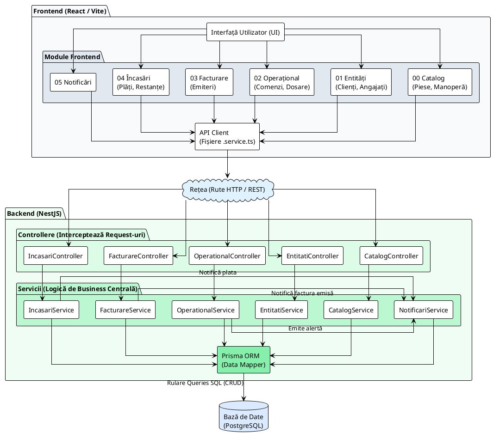
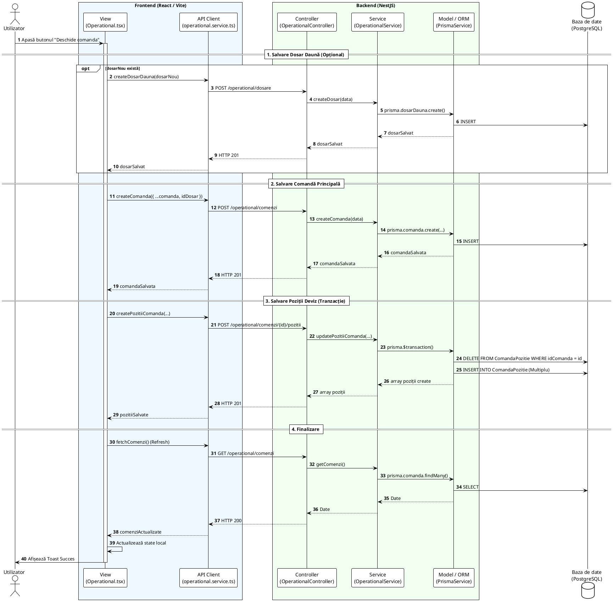

# Service Auto G — Aplicație de Management Service Auto

> [!IMPORTANT]
> Pentru o privire de ansamblu asupra structurii tehnice, a deciziilor de design și a cerințelor funcționale, consultă:
> - [ARHITECTURĂ APLICAȚIE](documentation/ARHITECTURA.md)
> - [SPECIFICAȚII DE CERINȚE (REQUIREMENTS)](documentation/requirements.md)

Aplicație full-stack pentru administrarea unui service auto. Acoperă recepție vehicule, dosare de daună, comenzi de reparație, catalog piese & manoperă, kituri de piese, facturare fiscală, încasări și notificări persistate în baza de date.

---

## 🏛️ Arhitectură și Design (Sinteză)

Sistemul este construit pe o **arhitectură în 3 straturi** (3-tier) cu o implementare strictă a modelului **MVC**:

1.  **Stratul de Prezentare (Frontend - React 19)**:
    *   **View**: Componente `.tsx` (doar afișare, fără logică).
    *   **Controller**: Hook-uri `useX.ts` (gestionează starea și logica paginii).
    *   **Model**: Servicii `*.service.ts` (izolează apelurile API).

2.  **Stratul de Logică (Backend - NestJS)**:
    *   Implementare **MVC Headless** (API-first, fără componenta **Model**).
    *   **Controller**: Rutare și validare DTO.
    *   **Service**: Logica de business (calcule, reguli, fluxuri).

3.  **Stratul de Date (Persistență)**:
    *   **Prisma ORM** acționează ca Model de date, comunicând direct cu **PostgreSQL**.

> [!TIP]
> Această separare asigură un cod curat, testabil și ușor de extins, unde fiecare fișier are o singură responsabilitate (**Separation of Concerns**). Toate cele 6 module principale (Catalog, Entități, Operațional, Facturare, Încasări, Notificări) respectă **exact același șablon**.

### Diagramă Arhitectură Generală (Component Diagram)




### Exemplu Flux de Bază (Salvare Preluare Auto)

Orice operațiune complexă de scriere urmează o secvență strict orchestrată. Mai jos este fluxul complet de creare a unei reparații (Recepție Auto):




---

## 🚀 Simulator de Flux (Noutate!)

Aplicația include acum un **Simulator de Flux Operațional** (`AutomatedFlow.tsx`), un instrument avansat pentru demonstrații și testare automată care permite:
- **Populare Automată**: Inițializarea bazei de date cu date de test (piese, kituri, clienți, vehicule).
- **Scenarii Business Complexe**: Executarea automată a fluxului de recepție pentru diverse cazuri (Dosar RCA, Dosar CASCO, Reparație Directă).
- **Control Vizual**: Interfață blocată în timpul rulării, terminal de log-uri live și controale de viteză/pauză.
- **Validare E2E**: Verificarea întregului proces, de la intrarea mașinii în service până la emiterea facturii finale.

---

## Stack Tehnologic

| Strat | Tehnologie | Rol |
|-------|-----------|-----|
| Frontend UI | React 19 + TypeScript | Componente reactive, hook-uri de stare, React Portals pentru modale |
| Build & Dev Server | Vite 8 | HMR, bundle optimizat pentru producție |
| Stilizare | Tailwind CSS v4 | Clase utilitare direct în JSX |
| Animații | CSS Keyframes + Transitions | Animații fluide "slide-up", staggered list entries, feedback tactil |
| Formulare | react-hook-form + zod | Validare declarativă, fără rerender excesiv |
| Iconițe | lucide-react | Set consistent SVG icons |
| Notificări UI | sonner | Toast-uri non-blocante |
| Backend | NestJS (Node.js) | Module, Controllere, Servicii, DTO-uri |
| ORM | Prisma Client | Acces type-safe la PostgreSQL |
| Bază de date | PostgreSQL (Neon cloud) | Stocare relațională persistentă |

---

## Noutăți și Modernizare UI/UX (Mai 2026)

Recent, aplicația a trecut printr-un proces major de **modernizare estetică și funcțională**, trecând de la o interfață utilitară la o experiență **Premium & Fluidă**:

### 💎 Design System & Fluiditate
- **Experiență Premium**: Am implementat un sistem de modale centralizate cu `backdrop-blur-md` și animații de intrare `slide-up` elegante.
- **Micro-interacțiuni**: Toate elementele interactive (butoane, link-uri) beneficiază acum de feedback tactil prin `active:scale-[0.98]` și tranziții de culoare ultra-rapide.
- **Animații Staggered**: Rândurile din tabele (piese, manoperă) apar secvențial, oferind o senzație de fluiditate la încărcarea datelor.
- **React Portals**: Toate ferestrele de tip overlay (Gestiune Comenzi, Istoric Consum) sunt randate prin Portals pentru a asigura un blur perfect pe tot viewport-ul, fără conflicte de stacking context.

### 🛠️ Gestiune Avansată Operativă
- **Centralized Command Center**: Editarea comenzilor de reparație se face acum într-un modal "Side-by-Side" care separă clar datele vehiculului/clientului de devizul propriu-zis.
- **CRUD Deviz Real-time**: Adăugarea, modificarea cantităților și ștergerea articolelor se reflectă instantaneu în totalul general, cu calcul automat de TVA și subtotal.

### 📦 Monitorizare Activă Stoc & Istoric
- **Active Stock Alerts**: În ecranele de selecție (Recepție/Editare), stocul este monitorizat activ, afișând badge-uri colorate (În stoc / Lipsă stoc) pentru fiecare articol.
- **Consum Automat**: La emiterea unei facturi, sistemul **scade automat stocul** pentru toate piesele din comandă și, în cazul kit-urilor, pentru fiecare piesă componentă a acestora.
- **Istoric Consum Articol**: Un widget dedicat în Nomenclator permite vizualizarea instantanee a tuturor comenzilor în care a fost utilizată o anumită piesă, facilitând trasabilitatea.

---

---

## Pornire Rapidă

**Cerințe:** Node.js 20+, npm, variabila `DATABASE_URL` în `backend/.env`.

```bash
# Instalare dependențe
npm install --prefix backend
npm install --prefix frontend

# Pornire full-stack concurentă (din root)
npm run dev
```

URL-uri locale după pornire:
```
Frontend: http://127.0.0.1:5173
Backend:  http://127.0.0.1:3000
```

> Scriptul root (`scripts/dev.mjs`) pornește backend-ul NestJS și Vite în paralel și reafișează URL-urile după inițializare.

---

## Comenzi Utile

**Root (full-stack):**
```bash
npm run dev          # pornire full-stack
npm run build        # build producție ambele
npm run test         # teste backend
npm run lint         # lint ambele
```

**Backend:**
```bash
npm run start:dev --prefix backend
npm run build --prefix backend
npm test --prefix backend -- --runInBand
npm run lint --prefix backend
```

**Frontend:**
```bash
npm run dev --prefix frontend -- --host 127.0.0.1
npm run build --prefix frontend
npm run lint --prefix frontend
```

**Prisma / baza de date:**
```bash
cd backend
npx prisma validate          # verifică schema
npx prisma generate          # regenerează clientul după schimbări de schemă
npx prisma migrate status    # starea migrărilor
npm run seed                 # populează BD cu date demo (atenție: resetează!)
```

---

## Structura Repo

```
psi2026/
├── package.json             # scripturi root pentru full-stack
├── scripts/
│   └── dev.mjs              # pornire concurentă backend + frontend
├── documentation/           # modele proiect PSI (PDF) + documentație Word
├── backend/
│   ├── package.json
│   ├── prisma/
│   │   ├── schema.prisma    # modele, relații, enum-uri
│   │   ├── migrations/      # istoricul modificărilor de BD
│   │   └── seed/            # date demo pentru toate modulele
│   └── src/
│       ├── app.module.ts
│       ├── catalog/         # piese, manoperă, kituri
│       ├── entitati/        # clienți, angajați, asiguratori
│       ├── operational/     # vehicule, dosare daună, comenzi, pozitii deviz
│       ├── facturare/       # emitere facturi, iteme, next-number
│       ├── incasari/        # înregistrare și alocare încasări
│       ├── notificari/      # creare, citire, arhivare notificări
│       ├── workflows/       # teste de integrare full-flow
│       └── prisma/          # PrismaService singleton
└── frontend/
    ├── package.json
    └── src/
        ├── App.tsx           # router principal (sessionStorage-based navigation)
        ├── componente/ui/    # componente reutilizabile (Button, Field, StatCard...)
        ├── lib/
        │   ├── api.ts        # wrapper fetch cu API_BASE_URL
        │   └── pageState.ts  # hook usePageSessionState (persistă filtre între navigări)
        ├── mock/             # tipuri și date demo partajate (types.ts, notificari.ts)
        └── modules/          # (detaliat mai jos)
```

---

## Module Frontend

### `00catalog` — Nomenclatoare

| Submodul | Funcționalități |
|----------|----------------|
| `piesa/` | CRUD piese, stoc, preț bază, tip (Nouă/SH), garanție, grad uzură, badge stoc critic |
| `manopera/` | CRUD norme de timp, categorii (Mecanică Ușoară/Grea, Diagnoză, Electrică, Tinichigerie), medie normă |
| `kituri/` | Kituri (set ≥2 piese), reducere procentuală, calculator dinamic preț final, valoare economie client |

### `01entitati` — Entități Sistem

| Submodul | Funcționalități |
|----------|----------------|
| `client/` | Clienți PF/PJ, CNP/CUI/serieCI, sold debitor, activare/dezactivare |
| `vehicule/` | Flotă auto, VIN, marca/model, proprietar, istoric comenzi per vehicul cu navigare directă |
| `angajat/` | Personal (Manager/Mecanic/Receptioner), cost orar, specializare, **rol dublu (Mecanic + Inspector Daune)** |
| `asigurator/` | Societăți asigurare, CUI, termen plată zile, email daune, IBAN |

### `02operational` — Flux Operațional

**`preluare-auto/`** — Recepție vehicul:
- Selecție vehicul din flotă, validare comandă activă existentă
- Flux cu/fără asigurator, creare dosar daună sau dosar tehnic
- Deviz estimativ: adăugare piese, manoperă și kituri cu cantitate și preț editabile inline
- Calcul în timp real: subtotal, TVA, total
- Validare câmpuri obligatorii, preview număr comandă, contor pași flux

**`gestiune-comenzi/`** — Registru comenzi:
- Filtrare după status, mecanic, tip plată, termen depășit, text liber
- Sortare multi-câmp cu persistare în sessionStorage
- Panou detalii lateral: schimbare status, vizualizare deviz, mecanic asignat
- Navigare directă din Vehicule sau din Notificări cu highlight automat

### `03facturare` — Facturare

| Submodul | Funcționalități |
|----------|----------------|
| `facturare/` | Emitere factură din comandă finalizată, serie/număr/scadență, **discount comercial și penalizări**, linii extrase din deviz, total cu TVA |
| `istoric/` | Registru facturi emise, filtru tip operațiune, **vizualizare detalii cu discount/penalizări**, descărcare PDF |
| `penalizari/` | Calculul penalizărilor de întârziere, procent configurat, 2 zecimale, aplicare manuală |
| `oferte/` | Campanii și oferte comerciale |

### `04incasari` — Încasări

**`Incasari.tsx`** — Înregistrare încasare nouă:
- Selectare client → afișare facturi restante cu restul de plată calculat
- Alocare sumă pe una sau mai multe facturi simultan
- Modalitate: Cash / POS / Transfer Bancar
- Referință document generată automat: `CASH-001`, `POS-001`, `OP-001`
- La achitare completă → status factură → `Platita` automat
- Generare notificare de succes cu link direct în Istoric Încasări

**`IstoricIncasari.tsx`** — Registru:
- Toate încasările cu client, referință, modalitate, facturi stinse, sumă
- Căutare liberă
- Highlight vizual pe rândul relevant când se navighează din Notificări

### `05notificari` — Centru Notificări

- Notificări persistate în baza de date (nu doar în memorie)
- Tipuri: `Info`, `Avertizare`, `Succes`
- Funcționalități: marchează citit, arhivează, restaurează, șterge definitiv
- Navigare contextuală: click pe notificare → redirect pe pagina relevantă + highlight pe item (încasare, factură, comandă)

### `99demo` — Simulator Flux

- Instrument de demonstrație și testare automată
- Scenarii predefinite pentru fluxuri RCA, CASCO și Flotă
- Vizualizare progres, terminal de log-uri și control asupra interfeței
- Filtrare: Toate / Avertizare / Info / Succes / Arhivă

---

## Module Backend

### `catalog`
```
GET    /catalog/piese              → listă piese
POST   /catalog/piese              → creare piesă
PATCH  /catalog/piese/:id          → actualizare piesă
DELETE /catalog/piese/:id          → ștergere piesă

GET    /catalog/manopera
POST   /catalog/manopera
PATCH  /catalog/manopera/:id
DELETE /catalog/manopera/:id

GET    /catalog/kituri
POST   /catalog/kituri
PATCH  /catalog/kituri/:id
DELETE /catalog/kituri/:id
```

### `entitati`
```
GET   /entitati/clienti
POST  /entitati/clienti
PATCH /entitati/clienti/:id
PATCH /entitati/clienti/:id/status

GET   /entitati/angajati
POST  /entitati/angajati
PATCH /entitati/angajati/:id

GET   /entitati/asiguratori
POST  /entitati/asiguratori
PATCH /entitati/asiguratori/:id
```

### `operational`
```
GET   /operational/vehicule
POST  /operational/vehicule
PATCH /operational/vehicule/:id
PATCH /operational/vehicule/:id/status

GET   /operational/dosare
POST  /operational/dosare
PATCH /operational/dosare/:id

GET   /operational/comenzi
POST  /operational/comenzi
PATCH /operational/comenzi/:id

GET   /operational/pozitii?idComanda=X  → deviz comandă
POST  /operational/pozitii
PATCH /operational/pozitii/:id
DELETE /operational/pozitii/:id
```

### `facturare`
```
GET  /facturare                    → comenzi facturabile
GET  /facturare/:id                → detalii factură
POST /facturare                    → emitere factură
PATCH /facturare/:id
DELETE /facturare/:id
GET  /facturare/next-number        → numărul următor disponibil
GET  /facturare/:id/linii          → liniile dintr-o factură (din deviz)
```

### `incasari`
```
GET  /incasari                     → toate încasările cu alocări
POST /incasari                     → înregistrare încasare nouă + alocare pe facturi
GET  /incasari/facturi-restante    → facturi cu rest > 0 pentru selectare client
```

### `notificari`
```
GET    /notificari                 → toate notificările active
PATCH  /notificari/:id             → actualizare stare (citit, arhivat)
DELETE /notificari/:id             → ștergere definitivă
```

---

## Model de Date (schema.prisma)

### Modele

| Model | Câmpuri cheie |
|-------|--------------|
| `Client` | tipClient (PF/PJ), nume, prenume, CNP, CUI, telefon, email, adresa, soldDebitor, status |
| `Angajat` | tipAngajat, nume, prenume, CNP, costOrar, specializare, departament |
| `Asigurator` | denumire, CUI, emailDaune, IBAN, termenPlataZile |
| `Vehicul` | numarInmatriculare, marca, model, vin, idClient |
| `DosarDauna` | numarDosar, idClient, idVehicul, idAsigurator (opțional) |
| `Comanda` | numarComanda, status (enum), idDosar, idAngajat, idClient, idVehicul, totalEstimat |
| `ComandaPozitie` | idComanda, idArticol, tipArticol (PIESA/MANOPERA), cantitate, pretUnitar, idKit |
| `Piesa` | codPiesa, denumire, producator, categorie, pretBaza, stoc, tip (NOUA/SH), luniGarantie |
| `KitPiese` | codKit, denumire, reducere (%) |
| `KitPiesaItem` | idKit, idPiesa, cantitate |
| `Manopera` | codManopera, denumire, categorie, durataStd, pretOra |
| `Factura` | serie, numar, dataEmiterii, scadenta, status, idClient, idComanda, totalFaraTVA, tva, totalGeneral |
| `FacturaItem` | idFactura, descriere, cantitate, pretUnitar, cotaTva, idPiesa, idManopera, idKit |
| `Incasare` | idClient, data, suma, modalitate (enum), referinta |
| `IncasareAlocare` | idIncasare, idFactura, sumaAlocata |
| `Notificare` | tip, mesaj, paginaDestinatie, sursaModul, textActiune, citit, arhivata, metadata (JSON), idFactura, idComanda |

### Relații

```
Client ──< Vehicul
Client ──< DosarDauna
Client ──< Incasare
Client ──< Factura

Vehicul ──< DosarDauna
Asigurator ──< DosarDauna

DosarDauna ──< Comanda
Comanda ──< ComandaPozitie
Comanda ──< Factura
Comanda ──< Notificare

KitPiese ──< KitPiesaItem ──> Piesa
KitPiese ──< ComandaPozitie
KitPiese ──< FacturaItem

Factura ──< FacturaItem
Factura ──< IncasareAlocare ──> Incasare
Factura ──< Notificare
```

### Enum-uri

```
StatusReparatie:    IN_ASTEPTARE_DIAGNOZA → ASTEAPTA_APROBARE_CLIENT
                    → IN_ASTEPTARE_PIESE → IN_LUCRU → FINALIZAT → FACTURAT → ANULAT
StatusFactura:      Emisa · Platita · Anulata
ModalitateIncasare: Cash · POS · TransferBancar
TipNotificare:      Info · Avertizare · Succes
TipClient:          PF · PJ
TipAngajat:         Manager · Mecanic · Receptioner
TipPiesa:           NOUA · SH
StatusGeneral:      Activ · Inactiv
```

---

## Logica Backend (NestJS)

Structura standard NestJS: `Controller → Service → PrismaService → PostgreSQL`

- **Controller** — definește rutele HTTP (`GET`, `POST`, `PATCH`, `DELETE`), nu conține logică de business
- **DTO** — descrie forma datelor acceptate în request; `ValidationPipe` + `whitelist: true` elimină câmpurile nedefinite
- **Service** — conține logica aplicației: calcule, validări de business, apeluri Prisma
- **PrismaService** — singleton care gestionează conexiunea la baza de date
- **schema.prisma** — sursa unică de adevăr pentru structura bazei de date
- **migrations/** — istoricul tuturor modificărilor de schemă, aplicabil pe orice mediu

Exemplu flux complet:
```
POST /incasari
  → IncasariController.create(dto)
  → IncasariService.create(dto)
     → validare sume alocate ≤ rest factură
     → prisma.incasare.create() cu alocări nested
     → actualizare status factură dacă rest = 0
     → NotificariService.create() cu metadata idIncasare
  → răspuns JSON cu încasarea creată
```

---

## Comunicare Frontend ↔ Backend

Frontend-ul comunică exclusiv prin `fetch` via `api.ts`:
```ts
// lib/api.ts
export const API_BASE_URL = 'http://127.0.0.1:3000';
export async function apiJson<T>(path: string, options?: RequestInit): Promise<T>
```

Fiecare modul frontend are un `*.service.ts` care:
1. Apelează endpoint-urile NestJS
2. Transformă răspunsurile backend în tipuri TypeScript frontend
3. Traduce statusurile Prisma (enum uppercase) în statusuri UI (string descriptive)

Exemplu mapare status:
```ts
// operational.service.ts
const mapStatusFromPrisma = (s?: string): StatusComanda => {
  switch (s) {
    case 'IN_LUCRU': return 'In lucru';
    case 'FINALIZAT': return 'Finalizat';
    // ...
  }
};
```

---

## Componente UI Reutilizabile (`componente/ui/`)

| Componentă | Descriere |
|-----------|-----------|
| `StatCard` | Card indicator cu valoare, label, tonuri (default/success/warning/info/danger), icon opțional |
| `PageHeader` | Header de pagină cu titlu, descriere și slot pentru acțiuni (butoane) |
| `Button` | Variante: primary, secondary, outline, ghost; dimensiuni sm/md/lg; fullWidth |
| `Field` | Input text/number/date cu label, hint, eroare |
| `SelectField` | Select cu opțiuni, label, eroare |
| `ConfirmDialog` | Modal de confirmare cu titlu, descriere, butoane Confirmă/Anulează |
| `EmptyState` | Stare goală cu icon, titlu, descriere, acțiune opțională |
| `Card / CardContent` | Container card cu border și shadow |
| `StatusBadge` | Badge colorat per status comandă |

Design: glassmorphism, micro-animații hover, watermark icon decorativ în header-uri, inline editing cantitate/preț pe devize.

---

## Persistența Stării între Navigări

Hook-ul `usePageSessionState` din `lib/pageState.ts` funcționează ca `useState` dar sincronizează automat valoarea în `sessionStorage`. Filtrele, sortările și ID-urile selectate sunt păstrate când utilizatorul navighează între pagini și revine.

```ts
const [filtruStatus, setFiltruStatus] = usePageSessionState<StatusComanda | 'Toate'>(
  'gestiune-status', 'Toate'
);
```

Notificările folosesc același mecanism pentru a transmite ID-ul elementului relevant (`highlight-incasare-id`, `highlight-factura-id`, `gestiune-idComandaSelectata`) și a declanșa efectul de highlight pe pagina destinație.

---

## Fluxuri Principale

### 1. Recepție Auto
```
Selectare vehicul din flotă
  → Validare comandă activă existentă
  → Flux asigurare (DA: creare/selectare dosar daună + asigurator) / (NU: dosar tehnic auto-generat)
  → Completare deviz: piese + manoperă + kituri, cantitate și preț editabile inline
  → Validare câmpuri obligatorii (mecanic, termen promis, km)
  → Salvare → creare Comanda + ComandaPozitii în BD
```

### 2. Gestiune Comenzi
```
Vizualizare registru comenzi cu filtre multi-criteriu
  → Click comandă → panou detalii lateral
  → Schimbare status (dropdown) → PATCH /operational/comenzi/:id
  → Vizualizare deviz complet
```

### 3. Facturare
```
Selectare comandă cu status FINALIZAT
  → Linii factură extrase automat din deviz
  → Configurare: serie, număr, termen plată, discount comercial
  → Calcul: subtotal - discount + TVA 19% = total
  → POST /facturare → factură salvată → status comandă → FACTURAT
  → Notificare „Factură emisă" generată automat
```

### 4. Încasări
```
Selectare client → afișare facturi restante cu rest calculat
  → Introducere sumă încasată + modalitate plată
  → Alocare sumă pe una/mai multe facturi
  → POST /incasari → Incasare + IncasareAlocare create
  → Dacă rest factură = 0 → status factură → Platita
  → Referință auto-generată (OP-001, POS-001, CASH-001)
  → Notificare Succes cu link direct → Istoric Încasări + highlight rând
```

### 5. Notificări Contextuale
```
Eveniment în sistem (încasare, factură, stoc critic)
  → NotificariService.create() backend
  → Centru Notificări afișează notificarea
  → Click pe buton acțiune → sessionStorage.setItem('highlight-X-id', id)
  → onNavigate(paginaDestinatie)
  → Pagina destinație citește highlight-ul → animație amber 5 secunde
```

---

## Seed & Date Demo

```bash
npm run seed --prefix backend
```

Creează complet:
- **3 asiguratori** (Allianz, Generali, Omniasig) cu date de contact reale
- **5 angajați** (1 manager, 3 mecanici, 1 receptioner) cu cost orar
- **6 clienți** PF/PJ cu CNP/CUI, unii cu sold debitor
- **8 vehicule** asociate clienților, cu VIN și marcă/model
- **10+ piese** cu stocuri variate (inclusiv stoc critic <5), prețuri și tip
- **5 kituri** cu piese componente și procente de reducere
- **8 manopere** pe categorii diferite cu norme de timp
- **Dosare daună** legate de vehicule și asiguratori
- **Comenzi** în statusuri diverse: In lucru, Finalizat, Facturat
- **Facturi** emise, achitate parțial, achitate complet
- **Încasări** reale alocate pe facturi
- **Notificări** inițiale de tip Info, Avertizare, Succes

> ⚠️ Seed-ul **șterge și recreează** toate datele demo. Nu îl rula dacă ai date manuale importante de păstrat.

---

## Starea Validată

Backend verificat cu:
```bash
npx prisma validate && npx prisma generate && npx prisma migrate status
npm run build --prefix backend    # compilare TypeScript fără erori
npm test --prefix backend -- --runInBand   # teste Jest
npm run lint --prefix backend
```

Frontend verificat cu:
```bash
npm run build --prefix frontend   # vite build fără erori TypeScript
```

Endpoint-uri testate real: catalog, entități, operațional (vehicule, dosare, comenzi, pozitii), facturare, încasări, notificări.

---

## Cum Adaugi un Endpoint Nou

1. Verifică/actualizează modelul în `backend/prisma/schema.prisma`
2. Dacă ai modificat schema: `npx prisma generate` (+ migrare dacă e necesară)
3. Creează/actualizează DTO-ul în modulul potrivit (`*.dto.ts`)
4. Adaugă metoda în `*.service.ts` cu logica de business
5. Expune metoda prin `*.controller.ts` cu decoratorul HTTP corespunzător
6. Adaugă un test în `*.spec.ts`
7. Rulează verificările: `build` + `test` + `lint`

---

## Documentație

- [`backend/README.md`](backend/README.md) — detalii specifice backend
- [`frontend/README.md`](frontend/README.md) — detalii specifice frontend
- [`documentation/ARHITECTURA.md`](documentation/ARHITECTURA.md) — Arhitectură tehnică și design sistem
- [`documentation/requirements.md`](documentation/requirements.md) — Cerințe funcționale și non-funcționale
- [`documentation/`](documentation/) — modele de proiect PSI (PDF Partea 1-4) + documentație Word
