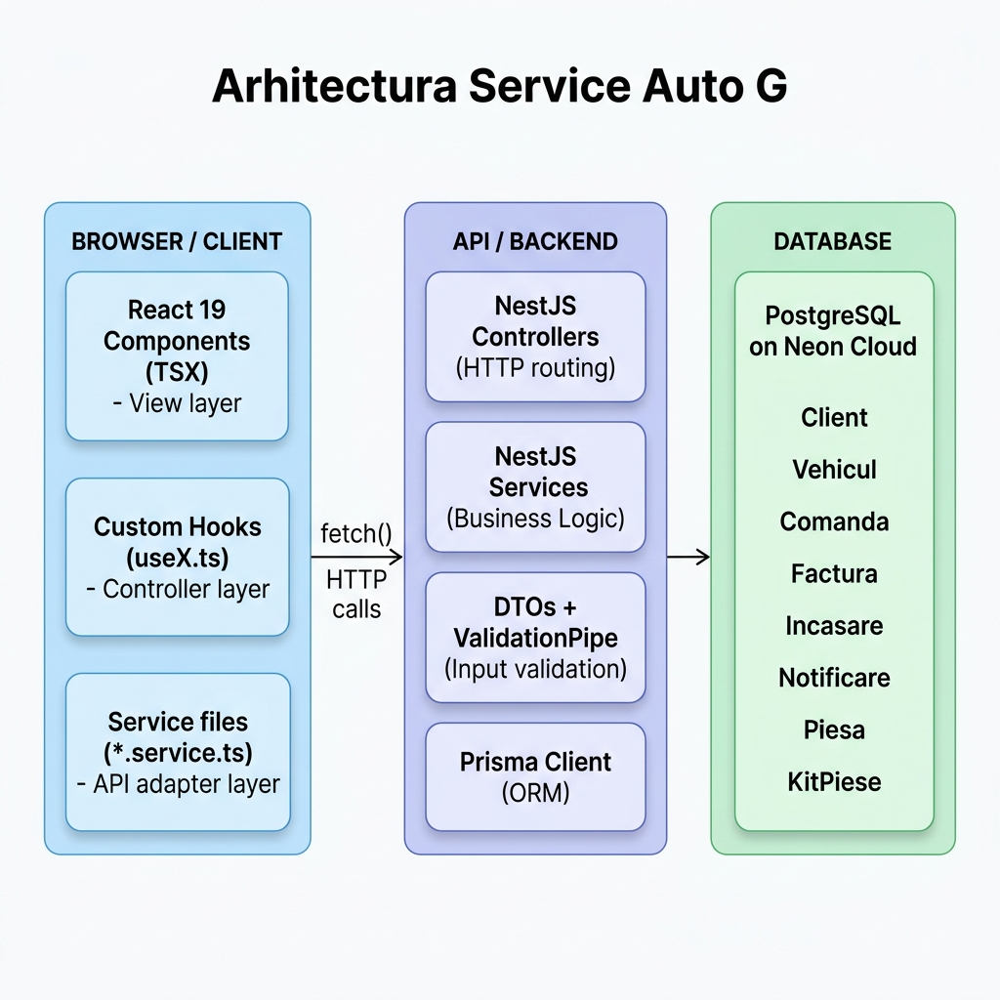
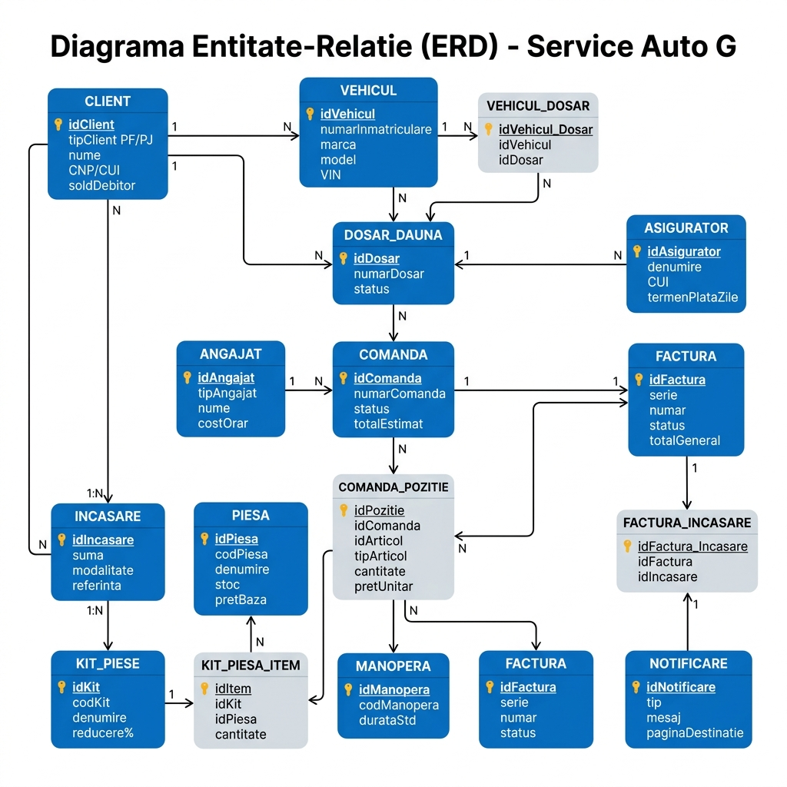
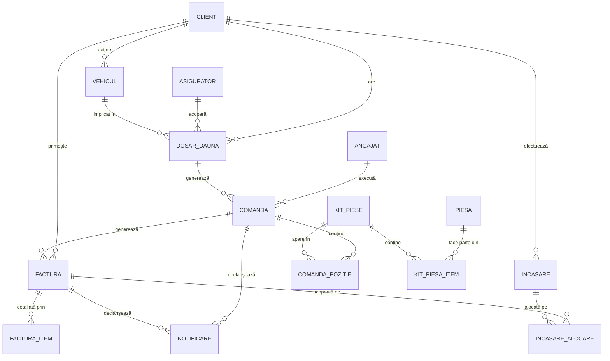

# Arhitectura Tehnică a Sistemului „Service Auto G”

Acest document detaliază structura internă, deciziile de design și fluxurile de date ale sistemului. Pentru cerințele funcționale detaliate, consultă [Specificațiile de Cerințe (Requirements)](requirements.md).
*Document de referință pentru prezentarea academică*

---

## Diagrama de Arhitectură



---

## 1. Tipul Arhitecturii

Aplicația folosește o **arhitectură pe trei straturi (3-tier layered architecture)** în combinație cu **MVC adaptat** pentru ambele capete (frontend și backend).

```
┌─────────────────────────────────────────────────────────────────┐
│  STRATUL DE PREZENTARE (Presentation Layer)                      │
│  React 19 + TypeScript + Vite → http://127.0.0.1:5173           │
├─────────────────────────────────────────────────────────────────┤
│  STRATUL DE LOGICĂ APLICAȚIE (Business Logic Layer)              │
│  NestJS → http://127.0.0.1:3000                                  │
├─────────────────────────────────────────────────────────────────┤
│  STRATUL DE DATE (Data Access Layer)                             │
│  Prisma ORM → PostgreSQL (Neon Cloud)                            │
└─────────────────────────────────────────────────────────────────┘
```

---

## 2. Implementarea MVC

### Backend — MVC Classic (NestJS)

| MVC | Implementare NestJS | Exemplu |
|-----|---------------------|---------|
| **Model** | Schema Prisma + DTO-uri | `schema.prisma`, `CreateComandaDto` |
| **View** | Nu există (API REST pur, JSON) | răspuns `res.json()` |
| **Controller** | `@Controller` + `@Get/@Post/@Patch` | `OperationalController` |
| **Service** | Logica de business | `OperationalService` |

> În NestJS, View-ul este înlocuit de răspunsul JSON consumat de frontend. Acesta este un pattern **MVC headless** sau **API-first**.

Flux cerere backend:
```
HTTP Request
  → Controller (rutare, extragere parametri)
    → DTO + ValidationPipe (validare input)
      → Service (logică business, calcule)
        → PrismaService (acces date)
          → PostgreSQL
              → răspuns JSON înapoi prin Controller
```

### Frontend — MVC Adaptat (React + Hooks)

React nu impune MVC direct, dar proiectul îl implementează explicit prin separarea fișierelor:

| MVC | Implementare React | Exemplu |
|-----|-------------------|---------|
| **Model** | `*.service.ts` + tipuri TypeScript | `operational.service.ts`, `types.ts` |
| **View** | Componente `.tsx` (prezentare pură) | `GestiuneComenzi.tsx`, `Kituri.tsx` |
| **Controller** | Hook-uri `useX.ts` (logică, stare, efecte) | `useGestiuneComenzi.ts`, `useKituri.ts` |

Flux date frontend:
```
Utilizator interacționează cu View (TSX)
  → View apelează handler din Controller (useX hook)
    → Controller actualizează starea sau apelează Model (service)
      → Model face fetch() la API backend
        → Răspuns → Controller actualizează starea
          → React re-randează View-ul cu datele noi
```

---

## 3. Separarea Responsabilităților (Separation of Concerns)

### Frontend — principii aplicate

**1. Componentele (View) nu conțin logică de business**
```tsx
// ❌ NU — logică în componentă
export default function GestiuneComenzi() {
  const comenzi = fetch('/comenzi').then(r => r.json()); // GREȘIT
  const filtrate = comenzi.filter(c => c.status === 'In lucru');
  return <table>...</table>;
}

// ✅ DA — componenta primește date gata procesate 
export default function GestiuneComenzi(props) {
  const { stare, setters, date } = useGestiuneComenzi(props);
  return <GestiuneComenziTable comenzi={date.liniiTabel} />;
}
```

**2. Hook-urile (Controller) nu randează JSX**
```ts
// useGestiuneComenzi.ts — DOAR logică, fără JSX
export function useGestiuneComenzi(props) {
  const [filtruStatus, setFiltruStatus] = usePageSessionState(...);
  const comenziFiltrate = useMemo(() => filtreaza(...), [...]);
  return { stare, setters, date }; // date procesate pentru View
}
```

**3. Service-urile (Model) nu știu nimic despre UI**
```ts
// operational.service.ts — DOAR comunicare API
export const OperationalService = {
  async fetchComenzi(): Promise<ComandaService[]> {
    const data = await apiJson<any[]>('/operational/comenzi');
    return data.map(mapComandaFromBackend); // transformare tip
  }
};
```

### Backend — principii aplicate

**1. Controller-ele nu conțin logică**
```ts
// ✅ Controller — DOAR rutare și delegare
@Get('comenzi')
async getComenzi() {
  return this.operationalService.findAllComenzi(); // delegare imediată
}

// ❌ NU — logică în controller
@Get('comenzi')
async getComenzi() {
  const comenzi = await this.prisma.comanda.findMany();
  return comenzi.filter(c => c.status !== 'ANULAT'); // GREȘIT
}
```

**2. Service-urile conțin toată logica de business**
```ts
// IncasariService — validare, calcule, efecte secundare
async create(dto: CreateIncasareDto) {
  // Validare: suma alocată ≤ rest factură
  const totalAlocat = dto.alocari.reduce(...);
  if (totalAlocat > dto.sumaIncasata) throw new BadRequestException(...);
  
  // Creare în BD
  const incasare = await this.prisma.incasare.create(...);
  
  // Efect secundar: actualizare status factură dacă e achitată complet
  if (restDePlata <= 0) await this.prisma.factura.update({ status: 'Platita' });
  
  // Efect secundar: generare notificare
  await this.notificariService.create({ mesaj: `Încasare de ${dto.suma} RON...` });
  
  return incasare;
}
```

**3. DTO-urile validează și documentează contractul API**
```ts
export class CreateIncasareDto {
  @IsInt() @IsPositive()       idClient: number;
  @IsNumber() @Min(0.01)       sumaIncasata: number;
  @IsEnum(ModalitateIncasare)  modalitate: ModalitateIncasare;
  @IsArray() @ValidateNested() alocari: AlocareDto[];
}
```

---

## 4. Modulare și Coeziune

### Backend — Module NestJS

Fiecare domeniu funcțional este un modul independent:

```
CatalogModule    → piese, manoperă, kituri
EntitatiModule   → clienți, angajați, asiguratori
OperationalModule → vehicule, dosare daună, comenzi, deviz
FacturareModule  → emitere facturi, calcul TVA
IncasariModule   → înregistrare plăți, alocare pe facturi
NotificariModule → evenimente sistem, persistență notificări
```

Dependențele între module sunt explicite:
```ts
// IncasariModule importă NotificariModule pentru a emite notificări
@Module({
  imports: [NotificariModule],
  providers: [IncasariService],
  controllers: [IncasariController],
})
export class IncasariModule {}
```

### Frontend — Module prin directoare

```
modules/00catalog/   → nomenclatoare (piese, manoperă, kituri)
modules/01entitati/  → entități sistem (clienți, vehicule, angajați, asiguratori)
modules/02operational/ → flux operațional (recepție, gestiune comenzi)
modules/03facturare/ → facturare, penalizări, oferte, istoric
modules/04incasari/  → înregistrare și istoric încasări
modules/05notificari/ → centru notificări cu navigare contextuală
```

Fiecare modul conține:
```
[modul]/
  ComponentaPrincipala.tsx  ← View
  useComponenta.ts          ← Controller (hook)
  componentа.service.ts     ← Model (API calls)
  componentа.helpers.ts     ← funcții pure de calcul/filtrare
```

---

## 5. Diagrama ERD și Model Conceptual

Sistemul folosește un model conceptual bazat pe entități interconectate. Structura bazei de date este sincronizată cu schema Prisma a proiectului. Puteți edita diagrama folosind fișierul sursă: [diagrama_erd_completa.drawio.xml](diagrama_erd_completa.drawio.xml) (deschideți în diagrams.net).





---

## 6. Fluxul de Date End-to-End (Exemplu: Înregistrare Încasare)

```
1. Utilizatorul completează formularul de încasare în browser
   └─ View: Incasari.tsx

2. Submit apelează handler-ul din hook
   └─ Controller: useIncasari.ts → handleSubmit()

3. Hook-ul apelează service-ul
   └─ Model: incasari.service.ts → IncasariService.create(dto)

4. Service-ul face POST la API
   └─ fetch('http://127.0.0.1:3000/incasari', { method: 'POST', body: JSON })

5. NestJS Controller primește cererea
   └─ IncasariController.create(@Body() dto: CreateIncasareDto)

6. ValidationPipe validează DTO-ul
   └─ Respinge dacă suma < 0 sau alocări lipsesc

7. Service backend execută logica
   └─ IncasariService.create():
      a. Verifică: sumăAlocată ≤ restFactură
      b. prisma.incasare.create() + alocări nested
      c. Dacă restFactură = 0 → prisma.factura.update(status: Platita)
      d. notificariService.create() → notificare persistată în BD

8. Răspuns JSON → service frontend mapează la tip TypeScript
   └─ Model: mapIncasareFromBackend()

9. Hook actualizează starea locală
   └─ Controller: setIstoricIncasari([...])

10. React re-randează lista
    └─ View: tabel actualizat + toast "Încasare salvată!"
```

---

## 7. Tehnologii și Justificări

| Tehnologie | Justificare |
|-----------|-------------|
| **React 19** | Bibliotecă UI declarativă, componentizare, ecosistem matur |
| **TypeScript** | Type safety end-to-end, prinde erori la compilare nu la runtime |
| **NestJS** | Framework opinionated, impune arhitectura Module/Controller/Service |
| **Prisma** | ORM type-safe, migrări declarative, IntelliSense complet |
| **PostgreSQL** | Bază de date relațională ACID, suport JSON pentru metadata notificări |
| **Zod + react-hook-form** | Validare front-end sincronizată cu schema TypeScript |
| **class-validator** | Validare back-end prin decoratori pe DTO |
| **Tailwind CSS v4** | Rapid de stilizat, design consistent, fără CSS custom |

---

## 8. Puncte Cheie pentru Întrebările Profesorului

### „Ce arhitectură folosiți?"
> Arhitectură pe 3 straturi (Presentation → Business Logic → Data Access), cu MVC implementat pe ambele capete. Frontend-ul separă View (componente TSX), Controller (hook-uri), Model (service-uri). Backend-ul NestJS urmează MVC headless: Controller → Service → Prisma → PostgreSQL.

### „Cum e implementat MVC?"
> **Backend**: Controller-ul primește cererea HTTP și imediat o delegă Service-ului. Service-ul conține toată logica de business (validări, calcule, efecte secundare). Prisma este stratul de acces la date (Data Access Layer). **Frontend**: Componentele TSX sunt View-uri pure care nu conțin logică. Hook-urile `useX.ts` sunt Controller-ele care gestionează starea și efectele. Service-urile `.service.ts` sunt Model-ul, izolând comunicarea cu API-ul.

### „Cum e separarea responsabilităților?"
> Fiecare fișier are o singură responsabilitate: `.tsx` = ce se vede, `useX.ts` = cum funcționează, `*.service.ts` = cum comunică cu backend-ul, `*.helpers.ts` = calcule pure. Pe backend: Controller = rutare, DTO = contractul de date, Service = logica, Prisma = persistența.

### „De ce NestJS și nu Express?"
> NestJS impune o structură clară de Module/Controller/Service, ceea ce face codul predictibil și ușor de extins. Express este mai flexibil dar fără convenții, ceea ce poate duce la arhitecturi inconsistente în echipă.

### „Cum comunicați frontend cu backend?"
> Prin HTTP REST. Frontend-ul are un layer de servicii (`*.service.ts`) care encapsulează toate apelurile `fetch()`. Componentele React nu fac niciodată `fetch()` direct — delegă hook-ului, care delegă service-ului. Astfel, dacă se schimbă URL-ul API-ului, se schimbă doar service-ul.

### „Cum gestionați starea?"
> Nu folosim Redux sau Zustand. Starea locală a paginii e gestionată cu `useState` și `useReducer` în hook-uri. Pentru persistarea filtrelor între navigări, avem hook-ul `usePageSessionState` care sincronizează automat cu `sessionStorage`. Notificările sunt persistate în baza de date (nu doar în memorie).

---

## 9. Structura Modulelor Backend (rezumat)

```
backend/src/
├── catalog/
│   ├── catalog.controller.ts   → GET/POST/PATCH/DELETE /catalog/piese|manopera|kituri
│   ├── catalog.service.ts      → CRUD, validare unicitate cod
│   └── dto/catalog.dto.ts      → CreatePiesaDto, CreateManoperaDto, CreateKitDto
├── entitati/
│   ├── entitati.controller.ts  → CRUD clienți, angajați, asiguratori
│   ├── entitati.service.ts     → gestionare status activ/inactiv
│   └── dto/entitati.dto.ts
├── operational/
│   ├── operational.controller.ts → vehicule, dosare, comenzi, pozitii deviz
│   ├── operational.service.ts    → flux recepție, actualizare status comandă
│   └── dto/
├── facturare/
│   ├── facturare.controller.ts → emitere factură, next-number
│   ├── facturare.service.ts    → calcul TVA, linii din deviz
│   └── dto/
├── incasari/
│   ├── incasari.controller.ts  → GET facturi restante, POST încasare
│   ├── incasari.service.ts     → alocare, actualizare status factură, notificare
│   └── dto/incasari.dto.ts
├── notificari/
│   ├── notificari.controller.ts → CRUD notificări
│   ├── notificari.service.ts    → creare, marcare citit, arhivare
│   └── dto/
└── prisma/
    └── prisma.service.ts        → singleton conexiune BD
```
